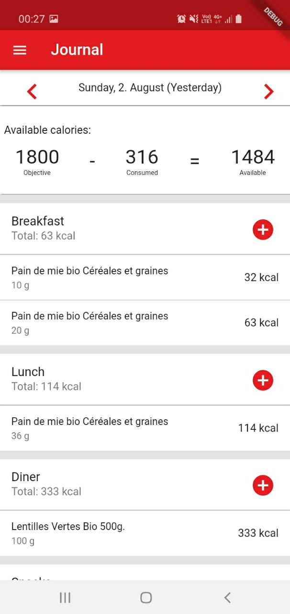

# Food Assistant

FoodAssistant is a similar to any calorie tracking applications.
You can enter the foods you eat, and get a daily summary of your calories.
It is possible to create foods that you can reuse when you need it, or directly scan the barcode of your products.

**All your data stays on your phone**, nothing is send to a server.



# Running the application on Nixos

Enter into the shell.

```
NIXPKGS_ALLOW_UNFREE=1 ns shell.nix
```

According to https://github.com/NixOS/nixpkgs/pull/76420#issuecomment-634273694, and https://github.com/NixOS/nixpkgs/issues/23910#issuecomment-634270758 it is not possible yet to use the sdk packaged within Nixos with flutter.
It causes a license error.
My solution is to install android-studio, and install the android SDK from here.

## Run on your phone

Launch the android server: `adb start-server`.
Then to run the application on your phone, use in a terminal: `flutter run`

## Start emulator with android-studio

launch android-studio and configure+launch an emulator. (Currently broken...)

## Launching on emulator  (**WIP**)

Create an emulator with android studio. It can be started later with flutter.
```
nix develop
fluter emulators
```

# Notes

- For some reasons, accepting android license causes `allowUnfree = true`, one quick workaround is to run the shell with: `NIXPKGS_ALLOW_UNFREE=1 nix-shell shell.nix`.
- If database not working with dlopen failing this link might fix it: https://stackoverflow.com/a/62308661
- I am interested to learn about the Bloc pattern. Looks like this article is a good entry point: https://www.didierboelens.com/2018/08/reactive-programming-streams-bloc/.

# Database

Any changes on the database tables needs to generate the flutter classes to be effective:

```
flutter packages pub run build_runner build --delete-conflicting-outputs
```

# Icon

To change the icon of the application:

```
flutter pub run flutter_launcher_icons:main
```

# Localization

Localization is bit complicated.
But when it is set up, it seems to works.

To create new text input to be translated, first add a new getter to the class: `lib/application_localization.dart`.

Then one can use the command from the project's root:

```
flutter pub run intl_translation:extract_to_arb --output-dir=lib/l10n lib/application_localization.dart
```

This will generate a the file `lib/l10n/intl_messages.arb` which is basically a template containing the string to localize.
Copy paste the new json entry that need localization into the files: `lib/l10n/intl_<local-code>`.
Once localized use the following command to generate the dart classes containing the localized values.

```
flutter pub run intl_translation:generate_from_arb --output-dir=lib/l10n --no-use-deferred-loading lib/application_localization.dart lib/l10n/intl_*.arb
```

# Deploy

The application bundle can be created with:

```
flutter build appbundle --target-platform android-arm,android-arm64,android-x64
```

To create the bundle to test doployement:
In the `shell.nix`, we have can inlude the android sdk containing the `aapt2` application.

```
androidSdk = pkgs.androidenv.androidPkgs_9_0.androidsdk;
```

Once we got the path to the `aapt2` binary we can call the bundletool with the proper aapt2 path.

```
java -jar bundletool-all-1.0.0.jar build-apks --bundle=build/app/outputs/bundle/release/app-release.aab --output=build/foodassistant/food_assistant.apks --aapt2=/nix/store/g91h4jyn5dj35xvlfch2z5h3d08mx7dh-androidsdk/libexec/android-sdk/build-tools/28.0.3/aapt2
```

or with the signing key:

```
java -jar bundletool-all-1.0.0.jar build-apks --bundle=build/app/outputs/bundle/release/app-release.aab --output=build/foodassistant/food_assistant.apks --aapt2=/nix/store/g91h4jyn5dj35xvlfch2z5h3d08mx7dh-androidsdk/libexec/android-sdk/build-tools/28.0.3/aapt2 --ks=../foodassistant.jks --ks-pass=pass:"password" --ks-key-alias=key
```

and then deploy the apk on a connected device:

```
 java -jar bundletool-all-1.0.0.jar install-apks --apks=build/foodassistant/food_assistant.apks
```

# Get CIQUAL DATABASE
fr: 
https://ciqual.anses.fr/cms/sites/default/files/inline-files/Table%20Ciqual%202020_FR_2020%2007%2007.xls

eng:
https://ciqual.anses.fr/cms/sites/default/files/inline-files/Table%20Ciqual%202020_ENG_2020%2007%2007.xls

# Todo

## V1 

- Add unknown barcode to OFF master
- Localize the application eng/fr.
  - Almost done, find a way to localize the error form's error messages.
- Create a first login page, to enter user information such as the objective.
    - The initialization of the application allows to create the initialization date.
      The init date is then used as the first date the user can navigate from, and ensure the consistency of the objective data.
    - The login page / or the user page enables to find how to set the best objectives for your use cases
- Add Ciqual database

## Someday

- Use enum for: mealtype and objective

# Links

french database about food / calories
https://www.data.gouv.fr/fr/datasets/table-de-composition-nutritionnelle-des-aliments-ciqual/